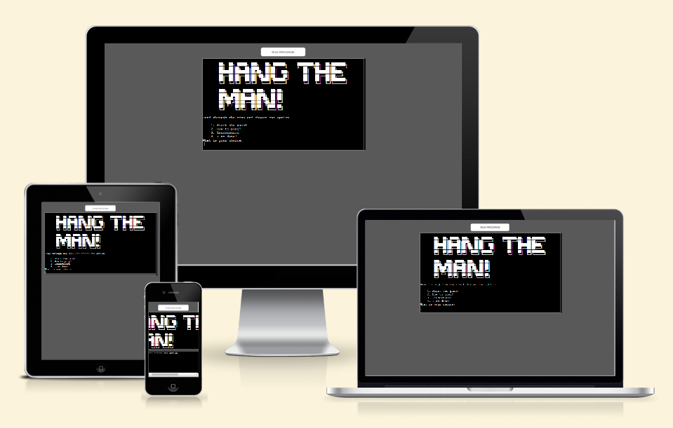
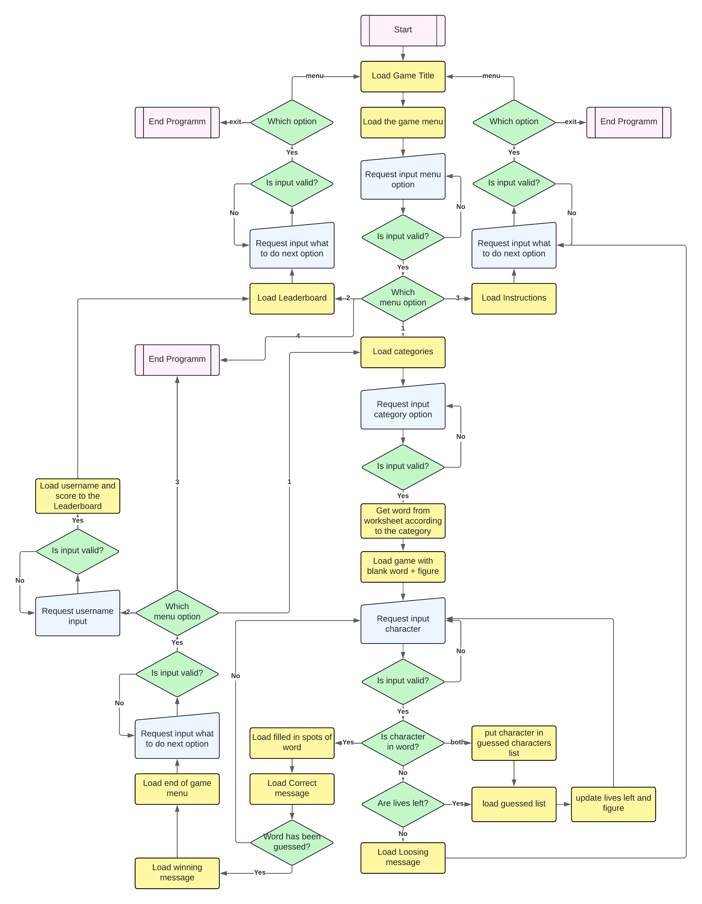

# Hangman Game
This Hangman game is a simple word-guessing game according to the general established rules of a hangman game. The user can choose words from different types of movie titles. They than have to to guess a random title one character at the time. The user has 8 lives, correlating with a stick figure image which will have more sticks "drawn" onto the more lives are lost due to wrong guesses. The user either guesses the word correctly or, when there are no more lives left, looses and the full figure of the hanged man is shown.

Depending on how much knowdledge the user has about movie title the user will have it easiert or harder in this game. However this puzzle is meant to improve the user's critical thinking and problem solving abilities before they run out of lives.

There are visual clues as each line of the word to guess represents one character and the correct guessed ones will appear on the according position in the word. Moreover, the wrong guesses will be shown in a list and do not count as a second live once they have been entered.

Interested? Then check it out here: [Hang the man!](https://hang-the-man-3409a28c593c.herokuapp.com/)

## Contents
- [HOW TO PLAY](#how-to-play)
- [SITE OWNER GOALS](#site-owner-goals)
- [USER EXPERIENCE (UX)](#user-experience-ux)
- [WIREFRAMES](#wireframes)
- [FLOW CHART / DECISION TREE](#flow-chart--decision-tree)
- [FEATURES](#features)
- [DATA MODEL](#data-model)
- [TESTING](#testing)
    - [User Stories Testing](#user-stories-testing)
    - [Fixed Bugs](#fixed-bugs)
    - [Known Bugs](#known-bugs)
- [TECHNOLOGIES USED](#technologies-used)
    - [Languages](#languages)
    - [Frameworks, Libraries and Programs used](#frameworks-libraries-and-programs-used)
- [DEPLOYMENT](#deployment)
- [CREDITS](#credits)
    - [Media](#media)
    - [Resources](#resources)
- [ACKNOWLEDGEMENTS](#acknowledgements)

## HOW TO PLAY

## SITE OWNER GOALS
- to provide the user with a fun short word-guessing game with different categories to choose from
- to prvide the user a a quick and challenging activity
- to prvide the user with a simple program that is easy to navigate through
- to provide the user with the option to save their score with their username, competing with other users for the first place

## USER EXPERIENCE (UX)
#### First Time User Goals
- I want to take a a word guessing quiz - hangman
- I want to understand the the program, its structure and how to play the game
- I want the quiz to be easy to use and navigate
- I want to be able to be tested on different categories
- I want to see how well I am doing during the game
- I want to take the quiz whenever, wherever

#### Returning User Goals
- I want to be able to be tested on different categories
- I want to be able to restart the game without reloading the page
- I want to get different words to be tested on when retaking the game

#### Frequent User Goals
- I want to be able to be tested on different categories
- I want to be able to restart the game without reloading the page
- I want to get different words to be tested on when retaking the game
- I want to save my best scores to a leaderboard to compete with other users

## WIREFRAMES

## FLOW CHART / DECISION TREE

The flow chart was created with [Lucid Chart](https://www.lucidchart.com/pages/) to help easily visualizing the flow of the program while passing each step. Like most decision trees some steps repeat themselves while other are final or starting points.

I wanted to show that winning and lossing the game isn't really an ending step as the user can still decide what to do afterwwards. This way the user has a lot of freedom and is not forced by the program on which route to take.

### Final Look

## FEATURES

## DATA MODEL

## TESTING

### User Stories Testing
#### First Time User Goals

#### Returning User Goals

#### Frequent User Goals

### Fixed Bugs
1. 

### Known Bugs

## TECHNOLOGIES USED
### Languages

### Frameworks, Libraries and Programs used
- [Am I Responsive](https://ui.dev/amiresponsive) Used for the mockup image.

## DEPLOYMENT

## CREDITS
### Media

### Resources

## ACKNOWLEDGEMENTS
