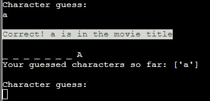
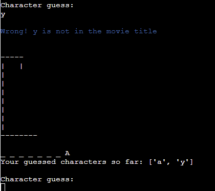
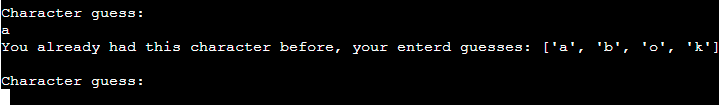

# Hangman Game
This Hangman game is a simple word-guessing game according to the general established rules of a hangman game. The user can choose words from different types of movie titles. They than have to to guess a random title one character at the time. The user has 8 lives, correlating with a stick figure image which will have more sticks "drawn" onto the more lives are lost due to wrong guesses. The user either guesses the word correctly or, when there are no more lives left, looses and the full figure of the hanged man is shown.

Depending on how much knowdledge the user has about movie title the user will have it easiert or harder in this game. However this puzzle is meant to improve the user's critical thinking and problem solving abilities before they run out of lives.

There are visual clues as each line of the word to guess represents one character and the correct guessed ones will appear on the according position in the word. Moreover, the wrong guesses will be shown in a list and do not count as a second live once they have been entered.

Interested? Then check it out here: [Hang the man!](https://hang-the-man-3409a28c593c.herokuapp.com/)

## Contents
- [HOW TO PLAY](#how-to-play)
- [SITE OWNER GOALS](#site-owner-goals)
- [USER EXPERIENCE (UX)](#user-experience-ux)
- [FLOW CHART / DECISION TREE](#flow-chart--decision-tree)
- [FEATURES](#features)
- [TESTING](#testing)
    - [PEP8](#pep8)
    - [Input Testing](#input-testing)
    - [Browser Testing](#browser-testing)
    - [User Stories Testing](#user-stories-testing)
    - [Fixed Bugs](#fixed-bugs)
    - [Known Bugs](#known-bugs)
- [TECHNOLOGIES USED](#technologies-used)
    - [Languages](#languages)
    - [Python Libraries](#python-libraries)
    - [Frameworks, Libraries and Programs used](#frameworks-libraries-and-programs-used)
- [DEPLOYMENT](#deployment)
- [CREDITS](#credits)
- [ACKNOWLEDGEMENTS](#acknowledgements)

## HOW TO PLAY
- The user can choose to play, see instructions, see leaderboard or exit the program
    - After viewing the instructions or leaderboard the user can return to the menu or exit the program
- The user can choose to guess movie titles from the following categories: Horror, Thriller & Fantasy
- The user has 8 lives, hence 8 chances, to guess the word
- A hint/hidden word is given at the beginning of the game as blank lines for each letter in the word
- The user has to guess one character at the time
    - If the character is correct the hint/hidden word will update with the location of the correct character and the user can guess again
    - If the character is wrong the a stick figure will appear with a "wrong guess"-statement and the user can guess again
    - The stick figure will continue to grow into a hanged man the more wrong guesses were placed
- When all characters are guessed a winning statement is shown and the user can decide on the following:
    - Playing the game again
    - Saving a username and score to the leaderboard
    - exit the programm
- When all lives are up a loosing statement is shown and the user can decide to return to the menu or exit the program

## SITE OWNER GOALS
- to provide the user with a fun short word-guessing game with different categories to choose from
- to prvide the user a a quick and challenging activity
- to prvide the user with a simple program that is easy to navigate through
- to provide the user with the option to save their score with their username, competing with other users for the first place

## USER EXPERIENCE (UX)
#### First Time User Goals
- I want to take a a word guessing quiz - hangman
- I want to understand the the program, its structure and how to play the game
- I want the quiz to be easy to use and navigate
- I want to be able to be tested on different categories
- I want to see how well I am doing during the game
- I want to take the quiz whenever, wherever

#### Returning User Goals
- I want to be able to be tested on different categories
- I want to be able to restart the game without reloading the page
- I want to get different words to be tested on when retaking the game

#### Frequent User Goals
- I want to be able to be tested on different categories
- I want to be able to restart the game without reloading the page
- I want to get different words to be tested on when retaking the game
- I want to save my best scores to a leaderboard to compete with other users

## FLOW CHART / DECISION TREE

The flow chart was created with [Lucid Chart](https://www.lucidchart.com/pages/) to help easily visualizing the flow of the program while passing each step. Like most decision trees some steps repeat themselves while other are final or starting points.

I wanted to show that winning and lossing the game isn't really an ending step as the user can still decide what to do afterwwards. This way the user has a lot of freedom and is not forced by the program on which route to take.

### Final Look
Final Look of the website/program before any input by the user has been entered:

## FEATURES
### Game Title

- An inviting title stlye was used so the user will not be too appalled by the basic black/white terminal design. Especially if the user has no knowledge of terminals they would still know that this is no error screen or that their pc didn't just crash.
 - The style was created by using [ASCII text](https://www.asciiart.eu/text-to-ascii-art) and applying one of their fonts on my title.

### Game Menu

- The Game menu is made up of 4 options: Start the game, How to Play, Leaderboard and I am done.
- This simple set-up is common for most smaller games and quizzes, therefore most useres should be familiar with its structure.

#### Game Menu - Input Validation

- If the user does not enter a number between 1 and 4 an Error Message will appear. This message repeats the input from the user and states that they will be given the chance to enter an input again.
- This message, as all error messages in this game, are printed out in red to indicate to the user that an error occured and their inputed data was invalid.

### How To Play?

- If the user chooses option 2, the terminal will be cleared and the instructions with how this game will be played are displayed.
- To, again, leave a more visually pleasing for the user the instructions are bordered by [ASCII-Art](https://www.asciiart.eu/art-and-design/borders) that should look familiar to a scroll.
- Below the instructions the user can once again choose to return to the main menu or exit the program with a "bye bye..." statement.

#### How To Play - Input Validation

- Unlike the above validator this validator takes full words as input (lower- or uppercase are fine) and returns an error message if the wrong data was entered.
- This was simply done to show that I am able to code various types of input validations.
- The error message, as all error messages in this game, are printed out in red to indicate to the user that an error occured and their inputed data was invalid.

### Leaderboard

- If the user chooses option 3, the terminal will be cleared and the leaderboard will be displayed.
- The leaderboard is ordered according to how many lives are left and then alphabetically according to the username.
- This is done by using the open source data analysis toolkit pandas. Pandas sorted and displayed the data from the spreadsheet into the leaderboard.
- The leaderboard spreadsheet is accessed and used to keep the data of the user (username and score) via an API.
- Below the leaderboard the user can once again choose to return to the main menu or exit the program with a "bye bye..." statement.

#### How To Play - Input Validation

- The exact same as the [How To Play - Input Validation](#how-to-play---input-validation)

### Hangman Categories

- If the user chooses option 1 three category options will be displayed for the user to choose from.

#### Categories- Input Validation

- If the user does not enter a number between 1 and 3 an Error Message will appear. This message repeats the input from the user and states that they will be given the chance to enter an input again.
- This message, as all error messages in this game, are printed out in red to indicate to the user that an error occured and their inputed data was invalid.

### Game Section

- No matter which category the user chooses, the terminal will be cleared and a hint/hidden word of lines appears.

- When the user enters the catageory Google Sheets were used to access the according sheet to the chosen category.

- This is done by Google Sheets APIs though the Goggle Clout Platform.
- The data is stored in each sheet will be randomly chosen and stored in a variable as a list.
- This list is converted into the underlined hint/hidden word.
- The user is then asked to enter their first character guess.

#### Correct Answer - Lives Left

- When the player enters a correct guess a statement that their answer was correct will be displayed.
- The hint/hidden word will be updated with the position of the guess. If the guess occurs multiple times in the word, it will be shown accordingly in the hint/hidden word.
- Below that a list will appear to show which characters have been guessed so far. This list is indedpendent if the answer was wrong or right, this is solely done to show the user what was already guessed in case they have forgotten.
- The updated hint/hidden word will be in uppercase to give the user a better visualization of what movie title needs to be find out.
#### Wrong Answer - Lives Left

- When the player enters a wrong guess a statement that their answer was wrong will be displayed.
- For the first wrong guess the hangman figure will be displayed for the first time.

- The more wrong guesses the user makes the more sticks will be "drawn" on to the figure.
- As most people are familiar with the game it was chosen to not write how many lives are left with each wrong guess, as it is visualized through the stick figure.
- The hint/hidden word remains the same, the guesses character list will be updated.

#### Repeated Answer

- When the user enters a guess they already entered a message will be displayed that they already had this guess. This is done independently if the guess is correct or not.
- The hint/hidden word will not be shown again as this message does not take that much space and the hint/hidden word should hence still be visible.

#### Correct Answer - No Lives Left

- When the user enters their final correct guess the terminal will be cleared.
- A winning statement will be displayed as well as further options for the user on how to proceed: Play again, Add lives left to the leaderboard or Exit with a "bye bye..." statement.
- When choosing playing again the user will be redirected to choose a category.

#### Wrong Answer - No Lives Left

- When the user enters their final wrong guess the full hangman figure will be displayed.
- The loosing statement will also reveal the correct movie title.
- The user can then choose to return to the menu or exit the game with a "bye bye..." statement. As this game is over this attempt was chosen because the user might want to re-read the isntructions. Therefore they have the opportunity to go back to the menu.

#### Guess Input Validation

- The user is only allowed to enter singular character form a-z at the time.
- There will be a red error message for the user to see what they did wrong and how to correct it.
- As the correct input is vital for the game the hint/hidden word what type of input is needed is given.
- This message, as all error messages in this game, are printed out in red to indicate to the user that an error occured and their inputed data was invalid.

#### Final Correct Answer Input Validation

- If the user does not enter a number between 1 and 4 an Error Message will appear. This message repeats the input from the user and states that they will be given the chance to enter an input again.
- This message, as all error messages in this game, are printed out in red to indicate to the user that an error occured and their inputed data was invalid.

#### Final Wrong Answer Input Validation

- The exact same as the [How To Play - Input Validation](#how-to-play---input-validation)

### Update Leaderboard

- After guessing the title correctly and choosing to add lives left to the leaderboard the user can enter their username.

- The Goggle worksheet also has a leaderboard spreadsheet here the username and the lives left of the current user and previous users are storedan retrieved through an API.
- As many names as people will play can hence be saved to the document. The leaderboard will always be updated as soon as it is called.

#### Username Input Validation

- As the username should max. be 15 characters long and should only consists out of letter from a to z, every other input is wrong.
- No matter what a user enters only within the given rules the input is accepted, else an error will be shown and the option to enter a username again is given.
- This message, as all error messages in this game, are printed out in red to indicate to the user that an error occured and their inputed data was invalid.

#### Updated Leaderboard

- With every new user the leaderboard will be updated when the user either choses it in the game menu or after winning a game.
- The way the data is retrieved, displayed and what the user can do afterwards is the same as [above](#leaderboard).

### Future Features
- Allowing the user to enter possible titles as well.
- Adding more categories.
- Adding difficulty levels to the categories. 

## TESTING
### PEP8 
No errors were returned for all python files from the [PEP8 CI Python Linter](https://pep8ci.herokuapp.com/) testing:

run.py

No errors or warnings.

hangman_figure.py

No errors or warnings.

### Input Testing
As shown in the feature section above all input fields were manually tested by me and returned the correct output depending if the input was valid or not.
All input fields only accepted the type of data that is needed to advance in the code to the next step. This has been tested in Gitpod IDF environment and on the deployed website.

### Browser Testing
The website was successfully tested on the following browsers:
- Google Chrome
- Mozilla Firefox
- Safari
- Microsoft Edge

### User Stories Testing
#### First Time User Goals
- I want to take a a word guessing quiz - hangman

    The user can start the hang man game as the very first option of the starting menu.
- I want to understand the the program, its structure and how to play the game

    Through the common structure found in various quiz and online hangman games most users should be already familiar with the game's set up. However, through the "How to Play?" Content the whole process of the game is easily explained step by step.
- I want the quiz to be easy to use and navigate

    All sentences, input commands, feedback statements and error messages are written in a simple language, as the quiz does not want the user to be overwhelmed when being tested. The user can return to the menu to get to the How to Play section.
- I want to be able to be tested on different categories

    The quiz offers three different movie title categories, all from the 200 most famous movies of each category.
- I want to see how well I am doing during the game

    The hangman figure, when guessing wrong, as well as filled out hints, when guessing correctly, give the user a clear indication on which path they are while trying to find out the title.
- I want to take the quiz whenever, wherever

    The user can take the game whenever they like on whichever browser they like, as long as they have internet connection.

#### Returning User Goals
- I want to be able to be tested on different categories

    The quiz offers three different movie title categories, all from the 200 most famous movies of each category.
- I want to be able to restart the game without reloading the page

    At the end of a correct round the user can immediately start another round. At the end of a failed attempt the user can go back to the menu, if they want to, read through the How to Play section and try again.
- I want to get different words to be tested on when retaking the game

    The title to guess is randomly taken from 10 movie titles per category from the according spreadsheet.

#### Frequent User Goals
- I want to be able to be tested on different categories

    The quiz offers three different movie title categories, all from the 200 most famous movies of each category.
- I want to be able to restart the game without reloading the page

    At the end of a correct round the user can immediately start another round. At the end of a failed attempt the user can go back to the menu, if they want to, read through the How to Play section and try again.
- I want to get different words to be tested on when retaking the game

    The title to guess is randomly taken from 10 movie titles per category from the according spreadsheet.
- I want to save my best scores to a leaderboard to compete with other users

    After winning a round the user can save their score (=lives left) and a username to the leaderboard spreadsheet. This can then even be accessed before starting a new round through the game menu option.

### Fixed Bugs
1. When running the hangman game itself the while loop would not stop when the 8 lives were up but rather was an endless loop. So the user could technically used endless tries.
    - I mistook the hangman_index variable (which I also at that step falsly incremented, which was corrected in the same commit) for the variable which was part of the condition for the while loop. I added j += 1 to the correct indented position and the loop would stop after 8 lives were up.

2. When a correctly guessed character was shown in the hint/hidden word only its first occurence was revealed even though the character occured multiple times in the movie title.
    - I got together with other students that reviewed my previous codes and encountered the same problem, after some time and a lot of research ([this cleared a lot up](https://stackoverflow.com/questions/44307988/find-all-occurrences-of-a-character-in-a-string)) we were able to come up with a solution. 
    - Instead of just using one index number I implemented a list of all occuring indexes on which the correct character occured. This list is looped through so every single occurence of the correctly guessed character was in the hint/hidden word.

As I was able to get rid of other problems while creating the according function, so the bug was never committed in the first place.

### Known Bugs
So far there are no known bugs.

## TECHNOLOGIES USED
### Languages
- Python
- CSS (for centering the terminal)

### Python Libraries
- [os](https://docs.python.org/3/library/os.html) - Used to clear the terminal when displaying new content.
- [gspread](https://docs.gspread.org/en/latest/) - Used to access and update data in Google spreadsheets.
- [random](https://docs.python.org/3/library/random.html) - Used to get a random movie title from the spreadsheet.
- [functools](https://docs.python.org/3/library/functools.html) - Used to to get rid of empty string values in list from spreadsheet.
- [time](https://docs.python.org/3/library/time.html) - Used to delay some code for a few seconds, such as the bye bye statement.
- [pandas](https://pandas.pydata.org/) - Used to display and sort leaderboard according to certain attributes.
- [colorama](https://pypi.org/project/colorama/) - Used to give fore- and background color to certain parts of the code.
- [google.oauth2.service_account](https://google-auth.readthedocs.io/en/master/reference/google.oauth2.service_account.html) - Used to set up the authentication needed to access the Google Cloud.

### Frameworks, Libraries and Programs used
- [Am I Responsive](https://ui.dev/amiresponsive) Used for the mockup image.
- [GitHub](https://GitHub.com/) - Used for version control.
- [Gitpod](https://gitpod.io/) - IDE to develop the website.
- [Lucid Chart](https://www.lucidchart.com/pages/) - Used to create a flow chart.
- [Heroku](https://dashboard.heroku.com/) - Used to deploy the project.
- [PEP8 CI Python Linter](https://pep8ci.herokuapp.com/) - Used to validate the Python code.
- Code Institute's Gitpod Template to generate IDE workspace.

## DEPLOYMENT
This project was deployed using Code Institute's mock terminal for Heroku.
1. Go on the [Heroku](https://dashboard.heroku.com/apps) website.
2. Activate the Heroku Student pack.
3. Choose the "Create new app" option on the dashboard.
4. Give name "hang-the-man", select region and go on the "Create app" option.
5. Go to the settings tab.
6. Go on "Reveal Config Vars".
7. Store all sensitive data such as my creds.json & port data.
    - enter keys CREDS & PORT
    - Enter content of creds.json as the CREDS' value
    - Enter 8000 as the PORT's value
8.  Go on the "Add buildbacks" option to build further dependencies.
    - Select the python buildpack first!
    - Select the node.js buildpack second!
9. Go to the deploy tab
10. Select Github as the deploxment method.
11. Confirm the connection to github.
12. Authorize correct repo to connect.
13. Go on either "Enable Automatic" or on "Deploy Branch" to deploy the website.
    - I selected "Deploy branch" while it is selected on main
14. Go on "View" to see live project.
15. On the live Website the program will start running automatically. If not go on the "Run Programm" button.

The live link can be found here - [Hangman game](https://hang-the-man-3409a28c593c.herokuapp.com/)

#### How to fork/clone the project locally on Github:

Fork the repository:
- Log in (or sign up) to Github.
- Go to the repository for: Xakkusu/hangman-game.
- Click the Fork button in the top right corner.

Clone repository:
1. Log in (or sign up) to GitHub.
2. Go to the repository for: Xakkusu/hangman-game.
3. Click on the code button, select whether you would like to clone with HTTPS, SSH or GitHub CLI and copy the link shown.
4. Open the terminal in your code editor and change the current working directory to the location you want to use for the cloned directory.
5. Type 'git clone' into the terminal and then paste the link you copied in step 3. Press enter.
6. A clone of the repository will now be created on your machine.

## CREDITS
### Resources
- Tutorials from Code Institute's lessons that we learned in the course of our diploma-education used to understand the basic concepts of Python. Especially topics from the Love Sandwich project were helpful.

- [Stack Overflow](https://stackoverflow.co/)

- [W3Schools](https://www.w3schools.com/)

- [ASCII Art](https://www.asciiart.eu/text-to-ascii-art) for the game title

- [ASCII Art](https://www.asciiart.eu/art-and-design/borders) for the border art of my how to play section

- To understand on how to get all occurences of one character in a string I relied on the [Question](https://stackoverflow.com/questions/44307988/find-all-occurrences-of-a-character-in-a-string) from Piratenlulatsch on stackoverflow. The answers and follow-ups easily expained on how to solve such a problem with as less code as possible.

- To understand the concept of pandas and how to use it to sort and display data I relied on this [Guide to Sorting Data in Python](https://realpython.com/pandas-sort-python/) from Spencer Guy. Through this I was able to understand the content of [this website](https://pandas.pydata.org/docs/reference/frame.html) by pandas themselves about their DataFrames. With both I was able to sort and display the leaderboard according to my wishes even if I never worked with it beforehand.

- To understand how to remove all empty string elements from a list I relied on this article [Python Remove Empty Strings from List](https://sparkbyexamples.com/python/python-remove-empty-strings-from-list/) by Malli. Through this I was able to only use the title itself and not empty values for the movie title I wanted to be guessed. 

## ACKNOWLEDGEMENTS
- My mentor Antonio for their guidance and support.
- All students with whom I was able to exchange ideas for our projects. A special thank goes to [Flo](https://github.com/FlorianS4) with whom I was able to bounce ideas back and forth & when I got stuck he helped me a lot with my problems about reoccuring characters and getting stuck in loops.
- Code Institute for informative course material.
- The Code Institute's Slack community for support and reviewing my project.